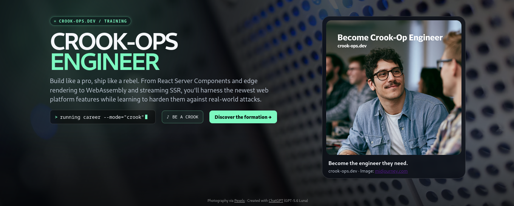

# Crook Ops

A small AWS deployment project serving the same application through three different environments.

**Domain:** `crook-ops.dev` (registered with [Namecheap](https://www.namecheap.com/))

The kubernetes cluster is only run on demand.

## Services

| Environment            | URL                                         |
| ---------------------- | ------------------------------------------- |
| Tomcat on EC2          | https://app.crook-ops.dev/crook-ops/        |
| Docker / Tomcat on EC2 | https://app.crook-ops.dev/docker/crook-ops/ |
| Kubernetes / EKS       | https://app.crook-ops.dev/k8s/crook-ops/    |

## Architecture

```text
                         HTTPS :443
                              │
                              ▼
                    ┌─────────────────┐
                    │   AWS ALB       │
                    │ crook-ops-alb   │
                    └────────┬────────┘
                             │
              ┌──────────────┼──────────────┐
              │              │              │
              ▼              ▼              ▼
        ┌──────────┐   ┌──────────┐   ┌─────────────┐
        │  Tomcat  │   │  Docker  │   │ Kubernetes  │
        │   EC2    │   │ Tomcat   │   │    EKS      │
        └──────────┘   │   EC2    │   └──────┬──────┘
                       └──────────┘          │
                                             ▼
                                            Pods
```
